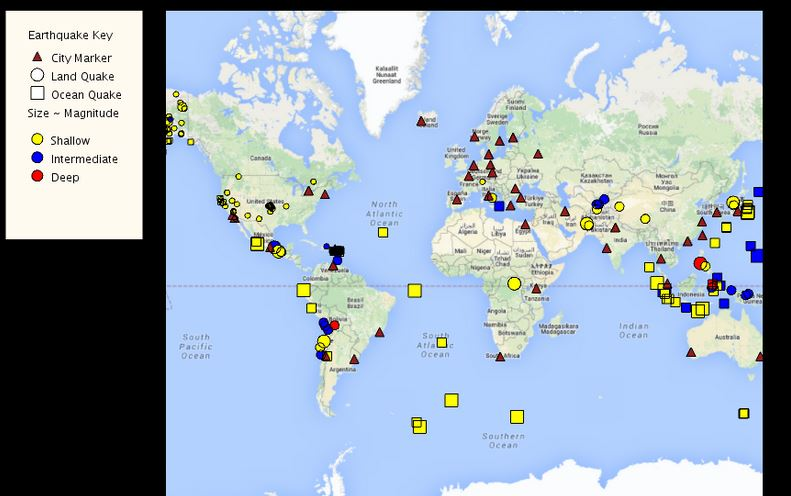

# EarthquakeMap
An application with an interactive map displaying earthquake data

# About
This project was completed in Coursera. The course explained basic concepts of OOP, after that I had to build an earthquake map 
with some hints. 

Two libraries was used: [Processing](https://processing.org/) and [Unfolging maps](http://unfoldingmaps.org/)
